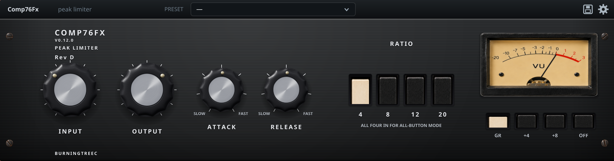

# Comp76Fx

Three circuit models of the classic 1966 FET limiting amplifier, one per
revision, built with [NIH-plug](https://github.com/robbert-vdh/nih-plug). Each
builds as CLAP and VST3.

| Plugin | Circuit | Character |
| --- | --- | --- |
| **Comp76Fx Rev A** | no low noise circuit, Class A output, painted meter surround | the most aggressive and the noisiest, and its ratios undershoot their markings |
| **Comp76Fx Rev D** | low noise circuitry, Class A output | the one most people mean; the reference reissue is patterned on the D and E |
| **Comp76Fx Rev F** | low noise, push-pull Class AB output | cleaner and tighter, with the distortion turning symmetrical |

They are not affiliated with, endorsed by, or connected to Universal Audio or
any other manufacturer. Model numbers are used only to say which circuit is
modelled.



## What it models

The unit is a **feedback** compressor: the sidechain samples the signal after
the gain element rather than before it. That is not a detail. With `k` as the
sidechain's gain, the loop settles at

```
g = -k / (1 + k) * (input - threshold)
```

so the slope is `1 / (1 + k)` and the ratio is simply `1 + k`. The 4:1 button
is `k = 3`; the 20:1 button is `k = 19`. The soft knee everyone describes is
not dialled in anywhere, it is what a feedback loop does.

* **The gain element is a FET** used as a voltage controlled resistor, and it
  distorts the audio passing through it increasingly as it is pulled down.
  That is most of why the unit sounds the way it does when it is working hard.
* **The recovery runs two stages together**, so it is program dependent rather
  than a fixed curve.
* **The sidechain runs out of rail** rather than clipping, but only where a
  real one would. At equilibrium the demand and the gain reduction are the
  same number, so a curve that bends from the origin bends the static ratio
  with it and every button reads low. It stays linear across the range the
  unit works in and turns over only near the rail.
* **All-button mode** opens the knee out instead of switching to another
  ratio. The shifted bias leaves the sidechain with no definite point at which
  it starts working, so the gain arrives over a range of level and the front of
  a transient is through before much of it has. Because the detector is fed the
  compressed output, the width of that knee sets the ratio as well as the
  shape, which is why it lands between 12:1 and 20:1 and keeps climbing the
  harder the unit is driven.

Measured by the tests in `core/tests/compression.rs`:

| | |
| --- | --- |
| 4:1 button | 4.02:1 |
| 8:1 button | 8.07:1 |
| 12:1 button | 12.12:1 |
| 20:1 button | 20.23:1 |
| all four in | 15.5:1 driven, 13.1:1 gently |
| no buttons in | exactly 1:1, colour with no gain reduction |
| attack | 19.5 µs to 794 µs against a marked 20 µs to 800 µs |
| release | 50.0 ms to 1100 ms against a marked 50 ms to 1.1 s |
| distortion, idle at −18 dBFS | Rev A 0.48 %, Rev D 0.33 %, Rev F 0.05 % |
| frequency response | within 0.53 dB across 20 Hz to 20 kHz |
| signal to noise | 97 dB, 107 dB and 109 dB |

`core/tests/calibration.rs` holds the published figures to those tolerances,
including the response at every sample rate and oversampling setting, and the
meter's needle against the marks printed on its own face.

Two of those are worth reading twice. All-button mode has no single ratio: its
knee is wide enough that the slope is still opening out at light reduction, so
the figure only means anything at a stated operating point, which is the same
caveat the manual's own "somewhere between 12:1 and 20:1" carries. And the
ratios sit about a percent high because the unit's own distortion takes energy
out of the fundamental the measurement reads; the loop itself, linearised,
lands a percent low, and the two nearly cancel.

## Controls

The panel is the hardware's. **Input** drives the signal against a fixed
operating point, which is how the unit is threshold-less; **output** is
make-up. Attack and release are marked slowest to fastest, which is backwards
from most compressors and is how the originals were engraved.

The four **ratio** switches are mechanically interlocked, so clicking one
releases the others. **Hold shift or ctrl to latch**, which is how you get all
four in at once without having to be quick with your fingers.

The **meter** switch selects gain reduction, output level referenced to +4 or
+8, or off.

The strip above the panel is not on the hardware. It carries the preset drop
down, a save button and the settings button, which holds the window scale
(50 % to 200 %), the oversampling quality and the dry blend.

Saved presets are one JSON file each, under a folder of the revision's own so
the three do not share, and each carries a cross to delete it that asks before
removing the file. A built-in preset has no file, so it cannot be deleted, and
saving under its name writes a preset of your own beside it rather than
replacing it in the list; replacing it would put it out of reach for good.

Built-in presets include **All Buttons In**: all four switches in, both dials
wide open, driven hard, with the make-up set so it comes back at unity.

## Building

```sh
./install.sh
```

Builds all three and installs the CLAP and VST3 of each into
`~/.clap/BurningTreeC` and `~/.vst3/BurningTreeC`. Pass `--no-build` to install
what is already built, or set `CLAP_PATH` and `VST3_PATH` to install elsewhere.

To build without installing:

```sh
cargo xtask bundle -p comp76fx_rev_a -p comp76fx_rev_d -p comp76fx_rev_f --release
```

To try one without a host:

```sh
cargo run --release -p comp76fx_rev_d --features standalone -- --backend auto
```

## Licensing

Under the **GNU General Public License version 3 or later**, whose text is in
[`LICENSE`](LICENSE). NIH-plug itself is ISC licensed, but `nih_export_vst3!()`
links the GPLv3 [vst3-sys](https://github.com/RustAudio/vst3-sys) bindings, so
any VST3 built with it has to be able to comply with the GPL.

[`THIRD-PARTY-NOTICES.md`](THIRD-PARTY-NOTICES.md) reproduces the licences and
copyright notices of every crate the plugins link. Noto Sans is compiled in for
the panel lettering and is under the SIL Open Font License 1.1. Regenerate the
file after changing dependencies:

```sh
python3 tools/third-party-notices.py
```

## Layout

| Path | |
| --- | --- |
| `core/src/dsp/detector.rs` | the feedback sidechain and its timing |
| `core/src/dsp/fet.rs` | the gain element and its distortion |
| `core/src/dsp/amp.rs` | the Class A and Class AB output stages |
| `core/src/editor/` | the front panel |
| `core/src/presets.rs` | built-in and saved presets |
| `rev_a`, `rev_d`, `rev_f` | one identity each; the circuit differences live in `Revision` |
| `core/tests/compression.rs` | the measurements above |
